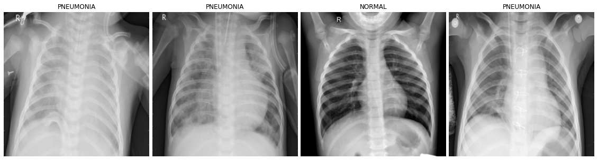
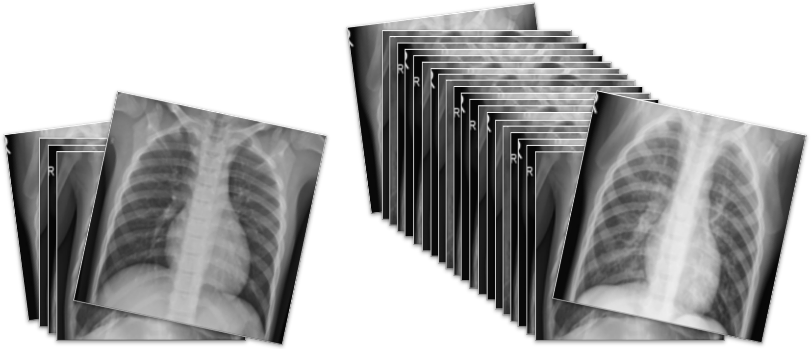
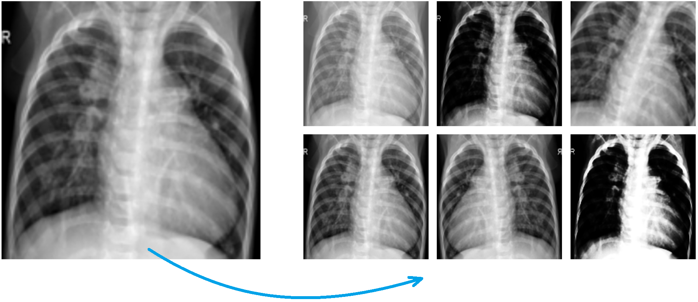
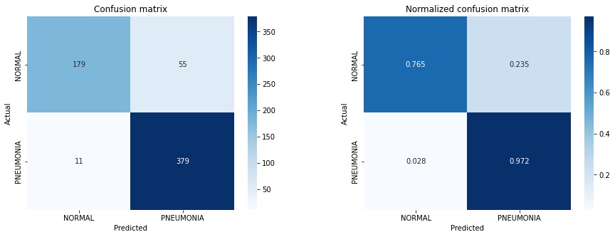
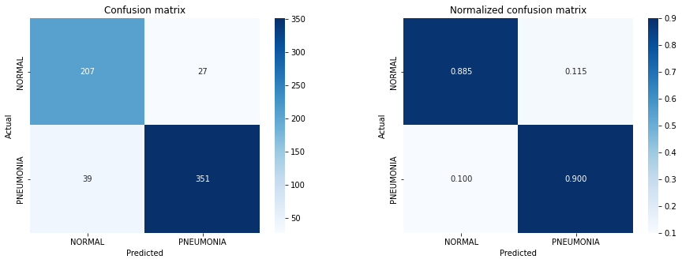
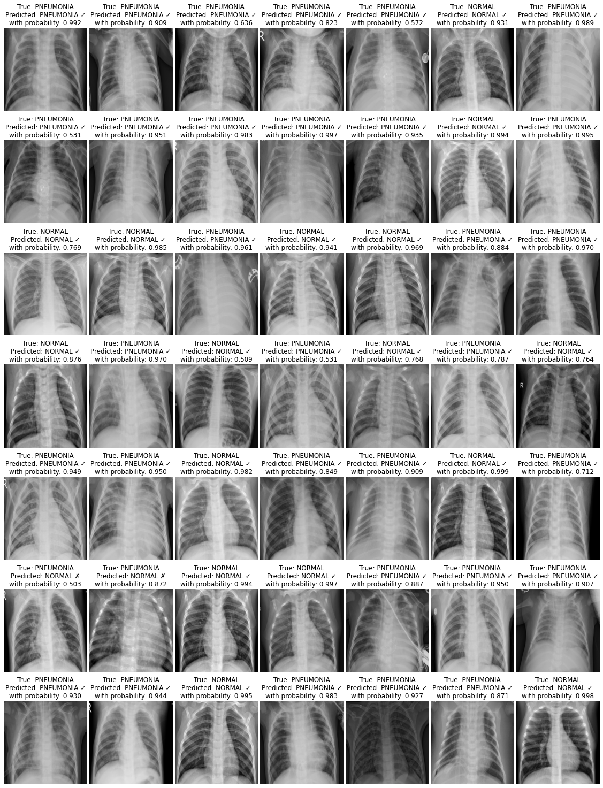

# **Pediatric Pneumonia Chest X-Ray Classification** 🫁
`PyTorch` approach to classification of pediatric pneumonia chest X-ray with CNN.

## 📖 **About**
Pediatric chest X-rays are harder to properly acquire and standardize when compared to adults, as for a children in a dark room, with people watching them from a glass window with strange machinery doesn't make for a comfortable experience. At the same time, children present a different physiology that is important to be captured in X-ray classification algorithms, as most datasets tend to focus on adults only.

The [dataset](https://www.kaggle.com/datasets/andrewmvd/pediatric-pneumonia-chest-xray) is organized into two folders, train and test, and contains subfolders for each image category, pneumonia and normal. Overall, there are 5856 Chest X-rays labelled as either pneumonia or normal: 1583 normal (1349 for training, 234 for testing) and 4273 pneumonia (3883 for training, 390 for testing). Chest X-ray images were selected from retrospective cohorts of pediatric patients of one to five years old from Guangzhou Women and Children’s Medical Center, Guangzhou. All chest X-ray imaging was performed as part of patients’ routine clinical care. For the analysis of chest X-ray images, all chest radiographs were initially screened for quality control by removing all low quality or unreadable scans. The diagnoses for the images were then graded by two expert physicians before being cleared for training the AI system. In order to account for any grading errors, the evaluation set was also checked by a third expert.

----------------------------------------------------

The goal of this project is to build an automatic classifier that can detect either a chest X-ray is associated with pneumonia or it is a normal chest X-ray. In addition, an implicit goal of the project it is to explore how `PyTorch` library works.

## 🧮 **Imbalanced data**

One of the main problems with this project is the fact that the two classes are not balanced. There are many more samples for `PNEUMONIA` than for `NORMAL`.

The approach to the image classification problem involves a neural network. To properly train a neural network (but in general, any classifier) it is necessary for the classes to be balanced. Let us assume that a classifier needs to be able to distinguish an event A from an event B. If the classifier is trained on a few imbalanced data, suppose 99 events A and 1 event B, it will be convenient for it to always predict event A (99\% accuracy on the training set). This is the reason why, when dealing with (strongly) imbalanced classes, as in this case, it is necessary to intervene. 

I approached the problem in two different ways.

### **1. Weighted classes**
The first approach is to train a neural network that associates each class with a certain weight. 
Suppose we deal with the case of an event A (99 samples) vs. an event B (1 sample):
* if for an event A the classifier predicts an event B, the weight of the error will be $\hspace{2pt}\frac{1}{99+1}$
* if for an event B the classifier will predict an event A, the weight of the error will be $\hspace{2pt}\frac{99}{99+1}$

In this way for the classifier it will no longer be convenient, as it was previously, to classify everything as an A event. 
As already intuited, in this context, the weight for each class is calculated as:

$\qquad class\hspace{2pt}weight = 1 - \frac{number\hspace{2pt}of\hspace{2pt}samples\hspace{2pt}of\hspace{2pt}the\hspace{2pt}class}{total\hspace{2pt}numer\hspace{2pt}of\hspace{2pt}samples}$

### **2. Augmented data**
The second approach is to generate the missing data. Regarding the dataset intended for training, the `PNEUMONIA` class has 3883 elements, while the `NORMAL` class has 1349 elements. Therefore, for the two classes to be balanced, it is sufficient to generate 2534 elements of the `NORMAL` class. 

What is meant by *generating* images? 
Starting from any image, it is possible to make a series of transformations to obtain images that are different among each other but still of the same category. In this way, by saving the generated images, it is possible to enrich the lacking class.

 
<i>On the left the original image, on the right the images generated by applying a series of 
transformations (zoom, light change, contrast change, rotation, etc.) to the original image. 
By saving all the generated images, from 1 sample it is possible to obtain (in this case) 6 samples.</i>

## 📝 **Results**
Through the use of `PyTorch` I build a convolutional neural networks for classification exploiting the neural network *DenseNet 161*. As well as for `TensorFlow` and `Keras`, also `PyTorch` makes several famous neural networks easily accessible, enabling transfer learning.

Detailed results of the two approaches mentioned above can be observed at the following links:

* [PyTorch - **Classes Weighting** & Transfer Learning](https://github.com/PaulinoMoskwa/Pediatric-Pneumonia-Chest-X-Ray/blob/master/PyTorch%20-%20Classes%20Weighting%20%26%20Transfer%20Learning.ipynb)
* [PyTorch - **Data Balancing** & Transfer Learning](https://github.com/PaulinoMoskwa/Pediatric-Pneumonia-Chest-X-Ray/blob/master/PyTorch%20-%20Data%20Balancing%20%26%20Transfer%20Learning.ipynb)

----------------------------------------------------

Both methods performed surprisingly well, leading to an accuracy on test images of 89.42%. 
However, while the overall accuracy on the test turns out to be the same, the errors made by the two networks are of different types. I calculated the confusion matrix on the test images for both classifiers and obtained the following results:

 
<i>Case of <b>weighted classes</b>.</i>

 
<i>Case of <b>augmented dataset</b>.</i>

Based on the confusion matrices we can see how different the results are. 
It is incorrect to say that one outcome outstands the other: one network is more convenient than the other depending on use cases.

## 🔬 **Visualization of some results**
Below I report the performance on test of the data augmentation approach. 
Each element is characterized by its true label, the model's prediction, and the confidence with which the model made its choice.

